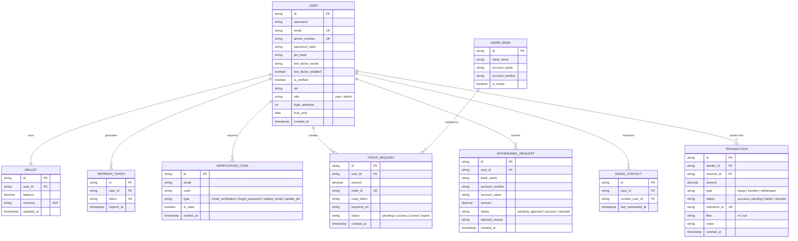

# System Architecture Blueprint — GreenPay E-Wallet Enterprise

**Dokumen Versi:** 2.0.0  
**Tanggal Diperbarui:** 16 September 2026  
**Status:** Approved  
**Peran:** Principal Mobile & Fullstack Architect (ex-CTO)  
**Lingkup Sistem:** Backend Modular Monolith & Client Mobile Clean Architecture

---

## 1. Topologi Sistem & Pola Arsitektur FinTech

Sistem GreenPay E-Wallet dirancang dengan prinsip **Resilience-First & Zero-Trust Architecture**, memadukan 4 fondasi utama:

```
+-----------------------------------------------------------------------------------+
|                            MOBILE CLIENT (REACT NATIVE)                           |
|  [Presentation: 25 Screens] <-> [Domain: UseCases] <-> [Data: Repos & DataSources]|
|             |                                                |                    |
|      (Secure Storage)                                (Offline SQLite)             |
|   Access Token (Memory/SSOT)                       Local Ledger & Balance         |
|   Refresh Token (Encrypted)                           Background Sync             |
+-----------------------------------------------------------------------------------+
                                       | HTTPS (SSL Pinning + Dual-Token Headers)
                                       v
+-----------------------------------------------------------------------------------+
|                        BACKEND MODULAR MONOLITH (EXPRESS.JS)                      |
|  [Security Middlewares: RateLimit, Helmet, Anti-Brute, AuthGuard, RoleGate]       |
|                                       |                                           |
|       +----------------+---------------+---------------+----------------+         |
|       | Auth Context   | User Context  | Payment Engine| Admin Clearing |         |
|       +----------------+---------------+---------------+----------------+         |
|               |                |               |                |                 |
|      (Dual-Token/OTP)    (KYC/Profile)   (ACID Ledger)   (Maker-Checker)          |
+-----------------------------------------------------------------------------------+
            |                                       |                     |
            v                                       v                     v
+-----------------------+              +-----------------------+ +------------------+
| MONGODB REPLICA SET   |              | MIDTRANS SNAP GATEWAY | | SMTP NOTIFICATION|
| (ACID Transactions,   |              | (Payment Redirect &   | | (Mailtrap OTP    |
| Polymorphic Ledger)   |              | Idempotent Webhooks)  | | CSPRNG Delivery) |
+-----------------------+              +-----------------------+ +------------------+
```

### 1.1. Dual-Token Authentication Lifecycle
- **Access Token (Stateless):** Masa berlaku 15 menit, membawa payload `userId` & `role`. Disimpan dalam transient memory / safe state untuk request API sehari-hari tanpa overhead query database.
- **Refresh Token (Stateful):** Masa berlaku 7 hari, disimpan terenkripsi di perangkat (SecureStorage) dan dicatat pada database MongoDB `RefreshToken`.
- **Rotasi Transparan (Axios Interceptor):** `api.ts` secara otomatis mendeteksi respons `401 Unauthorized`, menahan antrean request (*request queue*), memanggil `/api/v1/auth/refresh-token`, memperbarui token di memori, dan mengulang request semula (*replay request*).
- **Kill-Switch (Revokasi Sesi):** Saat pengguna logout atau akun terdeteksi anomali, paspor Refresh Token dihapus seketika dari database, memutuskan akses seluruh sesi aktif.

### 1.2. SQLite Local Cache & Offline-First Strategy
- **Single Source of Truth (SSOT):** `core/database/sqlite.ts` menyediakan penyimpanan lokal untuk riwayat mutasi transaksi (*Ledger*) dan profil pengguna.
- **Resiliensi Jaringan:** TanStack Query terintegrasi dengan `networkListener.ts` untuk memicu sinkronisasi latar belakang (*background refetch*) saat koneksi internet kembali pulih tanpa merusak tampilan pengguna (*zero UI flicker*).

### 1.3. Atomic Concurrency & Anti-Double Spending Engine
- **Mongoose ACID Transaction:** Seluruh mutasi saldo (Transfer P2P, TopUp Webhook, Withdrawal) dieksekusi dalam sesi `client.startSession()` atomik.
- **Pessimistic Hold Mechanism:** Pada permohonan penarikan dana (Withdrawal) dan transfer High-Value (≥ Rp 10 Juta), saldo pengirim dikunci dan dipotong saat itu juga ke status pembekuan (*held balance*), mencegah pengguna melakukan *double-spending* sebelum permohonan disetujui admin.
- **Conditional Auto-Refund:** Jika admin kliring menolak (*reject*) penarikan atau transfer, sistem mengembalikan dana secara atomik ke dompet pengguna.

---

## 2. Entity-Relationship Diagram (ERD)



---

## 3. Validasi & Audit Clean Architecture pada Mobile (`Wallet/src/`)

Struktur direktori mobile telah diaudit dan divalidasi memenuhi kaidah **Clean Architecture & SOLID Principles**:

```
Wallet/src/
├── core/                       # Infrastruktur global & cross-cutting concerns
│   ├── config/                 # Environment contract & runtime constants
│   ├── database/               # SQLite local persistence engine (sqlite.ts)
│   ├── di/                     # Dependency injection container & service locator
│   ├── network/                # Axios interceptor, QueryClient, SSL Pinning
│   ├── security/               # Biometrics, Device Integrity, SecureStorage
│   └── telemetry/              # Logging, crash diagnostics, error boundaries
│
├── domain/                     # Pure Business Logic (Framework-Agnostic)
│   ├── entities/               # Model domain murni (User, Wallet, Transaction, dll.)
│   ├── repositories/           # Interface kontrak repositori (IAuthRepo, IPaymentRepo)
│   ├── usecases/               # Logika bisnis interaksi tunggal (LoginUseCase, TransferUseCase)
│   ├── adapters/               # Port adapter interface
│   └── errors/                 # Spesifikasi domain failure & exceptions
│
├── data/                       # Implementasi Data Source & Konkret Repositori
│   ├── datasources/            # Remote API calls (Axios) & Local SQLite calls
│   ├── models/                 # Data Transfer Objects (DTO) dengan parser JSON
│   ├── mappers/                # Transformasi DTO (Data) <-> Entity (Domain)
│   └── repositories/           # Implementasi konkret dari domain repository interfaces
│
└── features/                   # Presentation Layer (Organized by Feature Slice)
    ├── auth/                   # 6 Layar autentikasi, hooks TanStack, & form validation
    ├── user/                   # 9 Layar profil, setting keamanan PIN/2FA, KYC, & mutasi
    ├── payment/                # 4 Layar transaksi transfer P2P, Midtrans WebView, withdraw
    └── admin/                  # 6 Layar kliring backoffice, persetujuan transaksi & neraca
```

### Hasil Validasi Lapis Arsitektur:
1. **Aturan Ketergantungan (*Dependency Rule*):** Lapisan `domain/` bebas dari dependensi UI (React/React Native) dan murni TypeScript. Modul `data/` dan `presentation/` hanya bergantung ke `domain/`.
2. **Pencegahan Memory Leak:** State server dikelola oleh TanStack Query dengan garbage collection 5 menit, sementara form state terisolasi per-layar.
3. **Keamanan Hardware:** Fitur `useScreenGuard.ts` mencegah cuplikan layar (*anti-screenshot*) pada layar finansial sensitif, dan `deviceIntegrity.service.ts` memverifikasi integritas perangkat dari *root/jailbreak*.

---

## 4. Kesimpulan Kesiapan Arsitektur (Architecture Readiness)
Arsitektur sistem backend dan frontend telah memenuhi standar produksi FinTech kelas Enterprise. Sistem siap melangkah ke tahap verifikasi kualitas regresi dan kesiapan deployment container.
