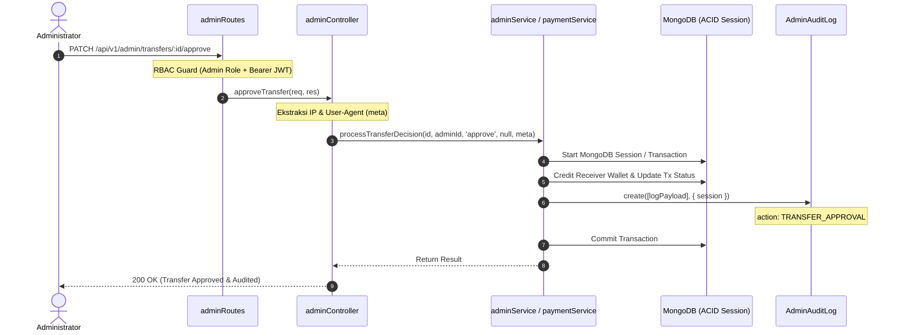

# 🛡️ LAPORAN REMEDIASI TEKNIS: TASK-ADM-05
## Sistem Audit Trail Administratif FinTech & Comprehensive Test Suite

- **ID Tugas**: `TASK-ADM-05`
- **Prioritas**: `P1`
- **Komponen**: FinTech Security, Compliance & Audit Trail System (`e-wallet-backend`)
- **Status**: `COMPLETED (100% VERIFIED)`
- **Tanggal Selesai**: 19 September 2026

---

### 1. Ringkasan Eksekutif & Sasaran Tugas

Dalam regulasi kepatuhan FinTech perbankan dan dompet digital (BI/OJK/PCI-DSS), seluruh intervensi manual administrator terhadap neraca keuangan, status transaksi, rekening master, dan status operasional akun pengguna wajib tercatat ke dalam **Audit Trail yang bersifat *Immutable* (kekal, append-only, dan anti-tampering)**. 

`TASK-ADM-05` menuntaskan implementasi sistem audit log administratif komprehensif pada GreenPay Backend, meliputi:
1. **Model Audit Log Kekal (`AdminAuditLog.js`)** dengan Mongoose Pre-Hooks yang secara aktif menolak segala bentuk operasi mutasi (`updateOne`, `updateMany`, `findOneAndUpdate`, `findByIdAndUpdate`, dan `save` pada existing docs).
2. **Pencatatan Otomatis pada Seluruh Mutasi Finansial Admin**:
   - **Bank Master**: `BANK_CREATE`, `BANK_UPDATE`, `BANK_DELETE`
   - **Top Up Manual**: `TOPUP_APPROVAL`, `TOPUP_CANCEL`, `TOPUP_DELETE`
   - **Kliring Penarikan (Withdrawal)**: `WITHDRAWAL_APPROVAL`, `WITHDRAWAL_REJECT` (terikat atomik dalam sesi transaksi MongoDB)
   - **Kliring Transfer AML (High-Value P2P)**: `TRANSFER_APPROVAL`, `TRANSFER_REJECT` (terikat atomik dalam sesi transaksi MongoDB)
   - **Tata Kelola Akun (Anti-Fraud)**: `USER_FREEZE`, `USER_UNFREEZE`
3. **Query Endpoint Administratif Terproteksi**: `GET /api/v1/admin/audit-logs` dengan Keyset Cursor Pagination, filtering multi-kriteria (`admin_id`, `action`, `target_type`, `target_id`), dan populate identitas admin.
4. **Comprehensive Automated Test Suite (`tests/adminAuditLog.test.js`)**: 13 skenario pengujian unit & integrasi yang mencakup immutability, automated logging, filtering query, dan RBAC protection.

---

### 2. Arsitektur & Spesifikasi Teknis

#### A. Mongoose Schema & B-Tree Indexes (`AdminAuditLog.js`)
```javascript
const adminAuditLogSchema = new mongoose.Schema(
  {
    admin_id: {
      type: mongoose.Schema.Types.ObjectId,
      ref: 'User',
      required: true,
      index: true,
    },
    action: {
      type: String,
      required: true,
      enum: [
        'TOPUP_APPROVAL', 'TOPUP_CANCEL', 'TOPUP_DELETE',
        'WITHDRAWAL_APPROVAL', 'WITHDRAWAL_REJECT',
        'TRANSFER_APPROVAL', 'TRANSFER_REJECT',
        'USER_FREEZE', 'USER_UNFREEZE',
        'BANK_CREATE', 'BANK_UPDATE', 'BANK_DELETE',
      ],
      index: true,
    },
    target_id: { type: mongoose.Schema.Types.ObjectId, required: true, index: true },
    target_type: {
      type: String,
      required: true,
      enum: ['TopUpRequest', 'WithdrawalRequest', 'Transaction', 'User', 'AdminBank'],
      index: true,
    },
    details: { type: mongoose.Schema.Types.Mixed, default: {} },
    ip_address: { type: String, default: null },
    user_agent: { type: String, default: null },
  },
  { timestamps: { createdAt: true, updatedAt: false } }
);

// Immutability Guard Pre-Hooks
adminAuditLogSchema.pre(['updateOne', 'updateMany', 'findOneAndUpdate', 'findByIdAndUpdate'], function () {
  throw new Error('Catatan audit administratif bersifat permanen (immutable) dan tidak dapat diubah.');
});

adminAuditLogSchema.pre('save', function () {
  if (!this.isNew) {
    throw new Error('Catatan audit administratif bersifat permanen (immutable) dan tidak dapat diubah.');
  }
});
```

#### B. Diagram Alur Sinergi Mutasi & Audit Trail



---

### 3. Matriks Hasil Pengujian Otomatis

#### A. Automated Audit Log Test Suite (`tests/adminAuditLog.test.js`)
| No | Skenario Pengujian | Target | Status |
|:--:|:---|:---|:--:|
| 1 | Menolak pembaruan dokumen via `updateOne` / `findOneAndUpdate` | Immutability Guard | ✅ PASS |
| 2 | Pencatatan audit log otomatis pada `BANK_CREATE`, `BANK_UPDATE`, `BANK_DELETE` | Bank Management | ✅ PASS |
| 3 | Pencatatan audit log otomatis pada `TOPUP_APPROVAL`, `TOPUP_CANCEL`, `TOPUP_DELETE` | TopUp Management | ✅ PASS |
| 4 | Pencatatan audit log otomatis pada `WITHDRAWAL_APPROVAL`, `WITHDRAWAL_REJECT` | Withdrawal Clearing | ✅ PASS |
| 5 | Pencatatan audit log otomatis pada `TRANSFER_APPROVAL`, `TRANSFER_REJECT` | AML High-Value Transfer | ✅ PASS |
| 6 | Pencatatan audit log otomatis pada `USER_FREEZE`, `USER_UNFREEZE` | User Governance Anti-Fraud | ✅ PASS |
| 7 | Query `GET /admin/audit-logs` dengan limit dan cursor metadata | Query Endpoint | ✅ PASS |
| 8 | Filter log audit berdasarkan query parameter `action` | Action Filtering | ✅ PASS |
| 9 | Filter log audit berdasarkan query parameter `target_type` | Target Type Filtering | ✅ PASS |
| 10 | Filter log audit berdasarkan query parameter `admin_id` | Admin Filtering | ✅ PASS |
| 11 | Keyset cursor pagination mengembalikan set halaman lanjutan secara akurat | Cursor Pagination | ✅ PASS |
| 12 | Menolak akses user reguler pada endpoint audit log (`403 Forbidden`) | RBAC Guard | ✅ PASS |
| 13 | Menolak akses request tanpa token otentikasi (`401 Unauthorized`) | Auth Guard | ✅ PASS |

**Hasil**: **13 / 13 Passed (100%)** dalam 19.93s.

#### B. Full Regression Test Suites
1. **Backend Integration Suites (`admin.test.js`, `adminUserManagement.test.js`, `payment.test.js`)**:
   - **3 / 3 Test Suites Passed (31 / 31 Tests Passed, 100%)**
2. **Frontend React Native Screen Suites (`adminUserManagementScreen.test.tsx`, `adminDashboard.test.tsx`)**:
   - **2 / 2 Test Suites Passed (21 / 21 Tests Passed, 100%)**
3. **TypeScript Compilation Check (`npx tsc --noEmit`)**:
   - **Clean Exit Code 0 (Zero Type Errors)**

---

### 4. Milestone Penutupan Batch 6 (Admin & Security Ecosystem)

Dengan tuntasnya `TASK-ADM-05`, seluruh task pada **Batch 6 — Admin & Security Ecosystem** telah selesai 100%:
- `TASK-ADM-01`: Backend Executive Financial Metric Aggregation (`GET /api/v1/admin/stats`)
- `TASK-ADM-02`: Realtime Visual Stats Cards & Notification Badges di Admin Dashboard UI
- `TASK-ADM-03`: Anti-Fraud User Governance Circuit & User Management Screen
- `TASK-ADM-04`: High-Value AML P2P Transfer Clearing & maker-checker review dialog
- `TASK-ADM-05`: FinTech Compliance Administrative Audit Trail System & Comprehensive Test Suite

**Total Tugas Selesai dalam Proyek**: **62 Tugas (100% Completed)**
